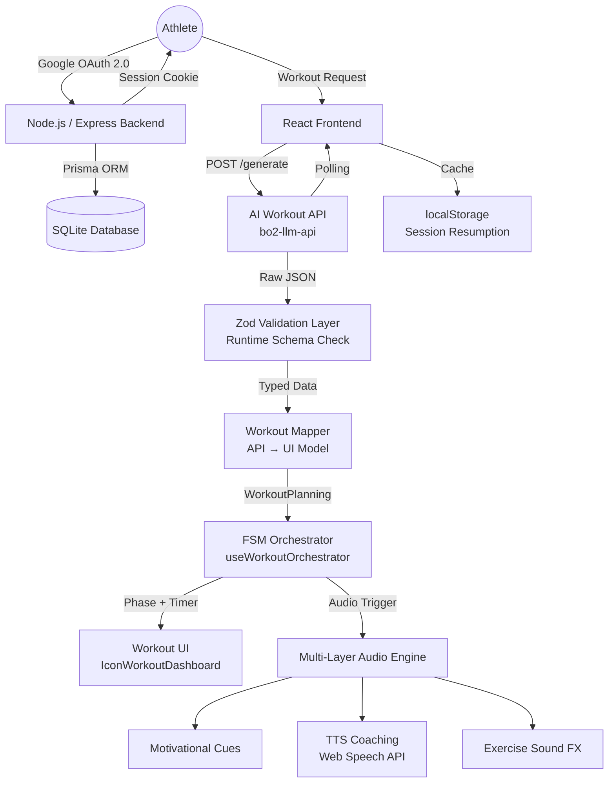
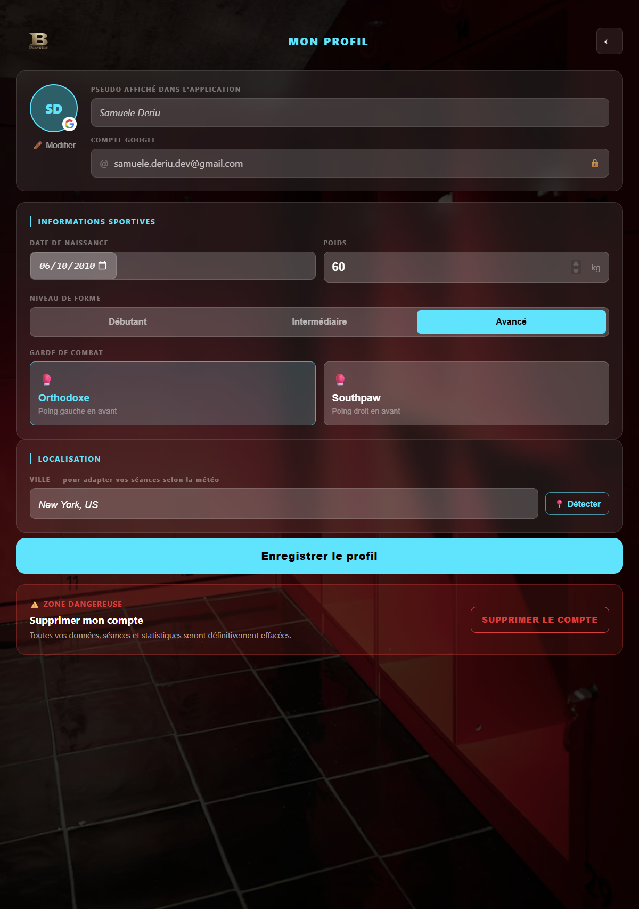
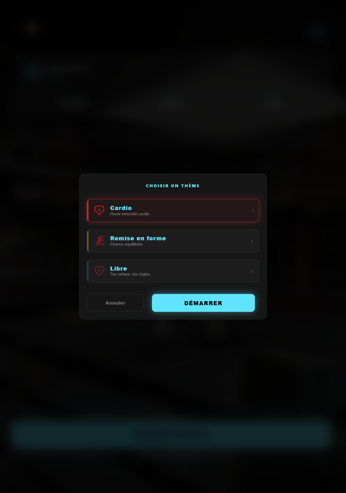
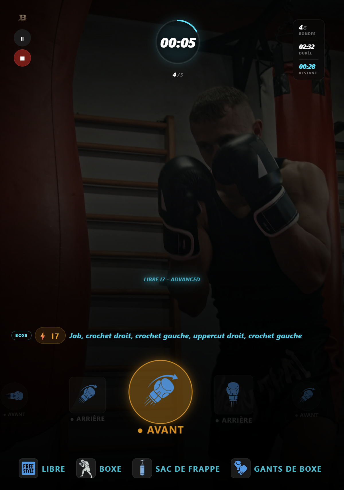
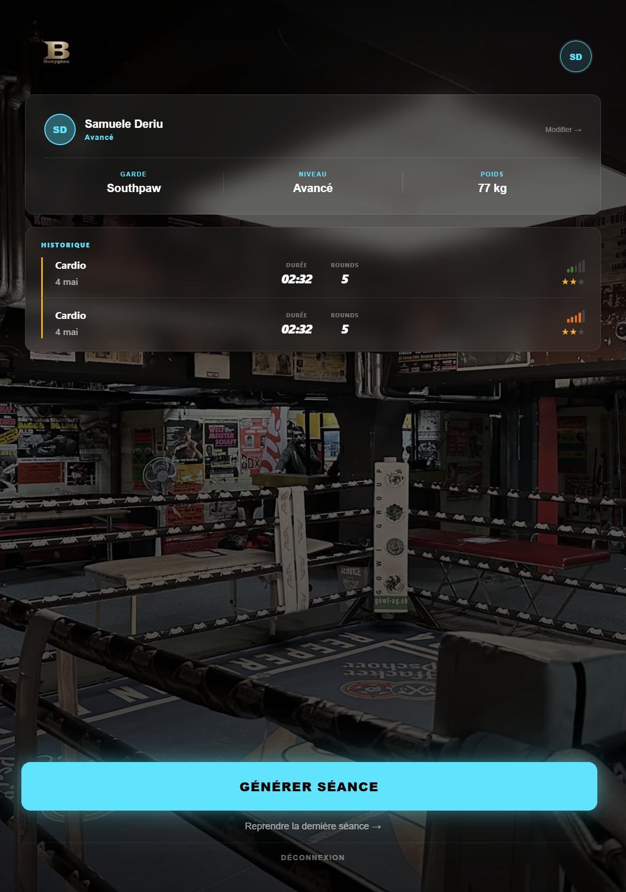
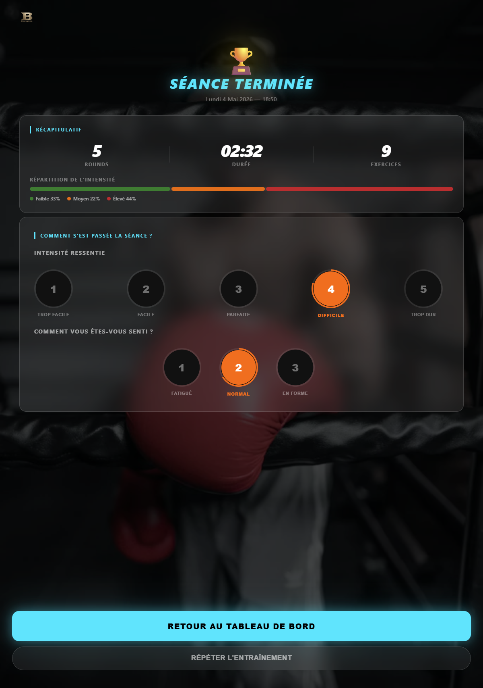

# 🥊 BoxApp — E-Training Boxing Platform

<p align="center">
  <em>A full-stack MVP developed during an internship at <a href="https://boxygene.ch/">Boxygene</a> — an interactive audio & visual coaching platform that orchestrates high-intensity boxing sessions in real time.</em>
</p>

<p align="center">
  
  
  
  
  
</p>
<p align="center">
  
  
  
  
  
  
</p>

---

> **⚠️ Showcase Repository**
> This repository documents the architecture, engineering decisions, and design process of a project developed during an internship at **[Boxygene](https://boxygene.ch/)** — a sports-tech startup building AI-driven training tools. The source code is maintained in a private repository to protect proprietary business logic and internal IP.

---

## 📋 Table of Contents

1. [Overview](#-overview)
2. [Key Features](#-key-features)
3. [System Architecture](#️-system-architecture)
4. [Tech Stack](#️-tech-stack)
5. [Engineering Deep Dive](#-engineering-deep-dive)
6. [Design System](#-design-system)
7. [My Role & Responsibilities](#-my-role--responsibilities)
8. [Security](#-security)
9. [Development Workflow](#-development-workflow)
10. [Application Showcase](#-application-showcase)
11. [Contact](#-contact)

---

## 📖 Overview

**BoxApp** is an interactive boxing training platform that acts as a real-time **Audio & Visual Coach**. The platform guides athletes through dynamically generated workouts, synchronizing precision timing, visual cues, and a multi-layered audio feedback system — all from a single, stateful user interface.

The platform was designed to integrate with an **AI backend** (`bo2-llm-api`) that generates structured, parameterized workout plans. My responsibility covered the entire client-side experience: validating the AI output, transforming it into UI-ready models, executing it through a custom state machine, and delivering it through a bespoke design system.

> 📺 **Vertical TV First**
> Unlike conventional mobile-first or desktop-first apps, BoxApp was engineered from the ground up for **portrait-oriented TV displays** used in gym environments. Every layout, font size, component proportion, and interaction model is optimized for large vertical screens — often viewed from several meters away during training.

---

## ✨ Key Features

| Feature | Description |
|---|---|
| 🔐 **Google OAuth 2.0** | Secure, frictionless login via Google. Sessions persisted with HTTP-only cookies to mitigate XSS. |
| ⏱️ **FSM Workout Orchestrator** | A Finite State Machine hook drives all workout phases (`COUNTDOWN → WORKOUT → REST → COMPLETED`) with sub-second precision. |
| 🎵 **3-Layer Audio Engine** | Concurrent audio streams for motivational cues, real-time TTS coaching, and contextual exercise sound cues. |
| 🎨 **Bespoke Design System** | Custom SCSS design system (no Tailwind/Bootstrap) with glassmorphism, dynamic intensity color coding, and pure CSS spring animations. |
| 🧠 **AI Workout Integration** | Async polling pipeline that fetches AI-generated workouts, validates them with Zod, and caches progress in `localStorage` for session resumption. |
| 🗺️ **Data Mapper Pattern** | A dedicated mapper layer decouples volatile API schemas from stable UI models, isolating the frontend from backend changes. |
| 👤 **Athletic Onboarding** | User profile setup capturing fitness level, boxing stance, weight, and age — used to tailor workout generation. |
| 🐳 **Containerized Deployment** | Multi-stage Docker builds for both frontend (Nginx) and backend (Node Alpine), orchestrated with Docker Compose. |

---

## 🏗️ System Architecture



---

## 🛠️ Tech Stack

### Frontend

| Technology | Version | Purpose |
|---|---|---|
| React | 18.3 | UI framework |
| TypeScript | 5.6 | Static typing (strict mode) |
| Vite | 6.0 | Build tool & dev server |
| React Router DOM | 6.28 | SPA routing with state persistence |
| Axios | 1.13 | HTTP client with credentials support |
| Zod | 4.3 | Runtime schema validation |
| SCSS (sass-embedded) | 1.85 | Modular styling, design tokens |
| vite-plugin-svgr | 4.5 | SVG assets as React components |

### Backend

| Technology | Version | Purpose |
|---|---|---|
| Node.js | 20.x | Runtime |
| Express | 5.2 | Web framework |
| Prisma | 5.17 | Type-safe ORM |
| SQLite (better-sqlite3) | — | Lightweight persistent storage |
| Passport.js | 0.7 | Authentication middleware |
| passport-google-oauth20 | 2.0 | Google OAuth 2.0 strategy |
| express-session | 1.19 | Session management |
| Jest + Supertest | 30.x / 7.x | Unit & integration testing |

### Infrastructure

| Technology | Purpose |
|---|---|
| Docker + Docker Compose | Multi-container orchestration |
| Nginx (Alpine) | Static file serving, API reverse proxy, SPA fallback |
| Docker Volumes | SQLite data persistence across container restarts |

---

## 🚀 Engineering Deep Dive

### 🧠 Finite State Machine — Workout Orchestrator

The core of the application is a custom React hook (`useWorkoutOrchestrator`) that implements a strict FSM. It processes a `WorkoutPlanning` object — a structured, timeline-based model with rounds, exercises, and parameterized actions — and drives every aspect of the UI.

**Phases:**
```
COUNTDOWN → WORKOUT → REST → WORKOUT → ... → COMPLETED
```

**Key mechanics:**
- 1-second tick interval via `setInterval`, managed inside a `useEffect`
- At each tick, calculates `elapsedInRound` and walks the exercise timeline to detect the **currently active action**
- Returns the active action's full `displayDetails` (punch type, arm, intensity, stance, target, distance, equipment) directly to the rendering layer
- Exposes `togglePause()`, `currentRoundIndex`, `remainingSeconds`, `phase`, `isWorkoutActive`
- The FSM is **not modifiable** — it is the single source of truth for all workout state

### 🗺️ Data Mapper Pattern

The AI backend returns deeply nested JSON structures that are subject to change. To shield the UI from these structural changes, a dedicated **mapper layer** (`workout.mapper.ts`) transforms the raw API response into a stable, flat, UI-optimized domain model (`WorkoutPlanning`).

This pattern means that if the AI API schema changes, only the mapper needs to be updated — no component logic is affected.

### 🎵 Multi-Layer Audio Engine

To keep the athlete focused on the bag (not the screen), the app delivers real-time coaching through three concurrent audio channels:

1. **Motivational Cues** — Dynamic pre-recorded phrases that fire between exercises to maintain intensity.
2. **TTS Technical Coaching** — Real-time voice prompts using the **Web Speech API** to announce the current punch combination, stance, or transition.
3. **Contextual Sound FX** — Short audio cues triggered on round start, round end, and exercise transitions.

Each channel is managed by a dedicated custom hook (`useMotivationalPhrases`, `useTTSPhrases`, `useComboAudio`, `useMovementAudio`) to keep concerns isolated.

### 🎨 Pure CSS Animation System

All UI animations are implemented with **native CSS `@keyframes`** and a custom `--ease-spring` CSS variable defined as a `cubic-bezier` spring curve — achieving smooth, springy motion without any JavaScript animation library.

The system includes 10+ named keyframe sequences: `page-enter`, `slide-up`, `wo-phase-in`, `wo-panel-in`, `comment-pulse`, `loader-heartbeat`, `loader-shimmer`, `phrase-appear`, `go-punch`, `end-impact`, and more.

This keeps the bundle lean, eliminates external dependencies, and gives full control over timing per component.

### ✅ Zod Validation Pipeline

The AI-generated workout JSON is treated as **untrusted external input**. Before being passed to any component, it is strictly validated by a Zod schema (`workout.schema.ts`) that mirrors the full domain model — including nested arrays, discriminated unions for exercise types (`Blow | Gym | Defend | Attack | Rest`), and optional fields.

Any structural mismatch throws at the boundary, preventing silent runtime errors deep in the state machine.

---

## 🎨 Design System

Built from scratch to match the **Boxygene brand identity** and the unique constraints of vertical TV displays.

### Color Palette

| Token | Hex | Usage |
|---|---|---|
| `$color-red` | `#C62828` | Brand primary, danger, Cardio theme |
| `$color-gold` | `#FFB300` | Brand accent, Remise theme |
| `$color-primary` (Cyan) | `#00e5ff` | UI accent, highlights, focus states |
| `$color-black` | `#0a0a0a` | App background |

### Workout Themes

Three selectable themes dynamically shift the accent color of the entire UI:

| Theme | Color | Intended Use |
|---|---|---|
| 🔴 **Cardio** | Red `#C62828` | High-intensity cardio rounds |
| 🟡 **Remise en forme** | Gold `#FFB300` | Fitness & conditioning |
| 🔵 **Libre** | Blue `#1565C0` | Free training |

### Intensity Color Coding

The active exercise's intensity level (`I1`–`I8`) is reflected in real time through the UI color scheme:

| Level | Color | Description |
|---|---|---|
| I1–I4 | 🟢 Green `#2e7d32` | Speed-based intensity |
| I5–I6 | 🟠 Orange `#ed6c02` | Power-speed hybrid |
| I7–I8 | 🔴 Red `#C62828` | Maximum power |

### Glassmorphism

Dark surfaces use `backdrop-filter: blur(16px)` with translucent borders (`rgba(255,255,255, 0.15)`) to create depth without heavy backgrounds — ensuring legibility on TV hardware with varied ambient lighting.

---

## 🤝 My Role & Responsibilities

**Role:** Fullstack Developer Intern at **[Boxygene](https://boxygene.ch/)**

I was responsible for the end-to-end development of the client-side platform, the authentication micro-service, and the integration layer. My work covered:

- **Frontend Architecture & UI/UX Design** — End-to-end ownership of the React application: component architecture, routing, state management, custom hooks, and the complete visual identity optimized for vertical TV displays.
- **Design System** — Designed and implemented the Boxygene-branded SCSS design system from scratch, including color tokens, typography, spacing, glassmorphism surfaces, and the CSS animation library.
- **Data Validation & Integration Layer** — Built the TypeScript + Zod validation pipeline and the Workout Mapper that translate AI-generated JSON into a stable, type-safe UI model.
- **Micro-Backend (Authentication Service)** — Designed and implemented the Node.js/Express backend handling Google OAuth 2.0, session management with HTTP-only cookies, and workout history persistence via Prisma + SQLite.
- **DevOps & Infrastructure** — Configured the multi-stage Docker builds, Nginx reverse proxy, and Docker Compose orchestration for local and production environments.
- **Quality & Testing** — Set up the Jest testing suite and TypeScript strict mode across the full codebase.

---

## 🔐 Security

| Measure | Implementation |
|---|---|
| **Authentication** | Google OAuth 2.0 via Passport.js — no password storage |
| **Session Security** | HTTP-only cookies prevent JavaScript access to session tokens (XSS mitigation) |
| **CSRF Protection** | `sameSite: 'lax'` cookie policy |
| **Input Validation** | Zod schemas validate all AI-generated payloads at runtime before processing |
| **CORS** | Nginx reverse proxy unifies frontend and API under a single origin — no open CORS headers in production |
| **Infrastructure** | API requests are proxied through Nginx; the backend is never directly exposed to the client |

---

## 🔄 Development Workflow

- **Git Strategy:** Feature-branch workflow — `feature/CORE-XX-description` → `develop` (integration) → `main` (stable releases)
- **Commit Convention:** [Conventional Commits](https://www.conventionalcommits.org/) for semantic versioning and automated changelog readability
- **Task Tracking:** JIRA-style task tracking with `CORE-XX` identifiers in branch names and commit messages
- **Code Quality:** ESLint with `eslint-plugin-react-hooks`, TypeScript strict mode, Zod for runtime safety

---

## 📸 Application Showcase

### 1. Login & Onboarding
*Google OAuth entry point followed by an athletic profile setup (fitness level, stance, weight). Clean dark UI optimized for first-time configuration.*



### 2. Home Dashboard
*Workout history cards with skeleton loading states. Theme selector for Cardio / Remise / Libre with live accent color switching.*



### 3. Dynamic Workout Interface
*The core workout execution screen. Shows active punch type, arm, intensity level, stance, target height, and equipment — all updating in real time from the FSM. Intensity color-codes the entire UI dynamically.*



### 4. Vertical TV Optimization
*Portrait-orientation layout engineered for large gym displays. High-contrast typography and icon sizing visible from 3–4 meters.*



### 5. Session Feedback
*Post-workout feedback screen with animated entry sequences and intensity/enjoyment rating collection.*



---

## 📩 Contact

Feel free to reach out to discuss the architecture, request specific code snippets, or talk about web development and sports-tech.

- **GitHub:** [@SamExperience](https://github.com/SamExperience)
- **LinkedIn:** [Samuele Deriu](https://www.linkedin.com/in/samuelederiu)
- **Company:** [Boxygene — boxygene.ch](https://boxygene.ch/)
